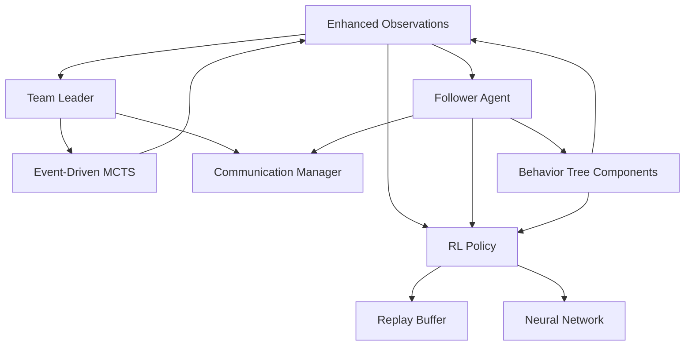

# SBDAPM Refactoring Plan: Hierarchical Multi-Agent Architecture

**Version:** 2.0
**Date:** 2025-10-27
**Status:** Planning Phase
**Target Completion:** 24 weeks (6 months)

---

## Executive Summary

This document outlines the complete refactoring of SBDAPM from a per-agent MCTS system to a hierarchical multi-agent architecture that separates strategic decision-making (team leader) from tactical execution (followers).

### Key Changes

| Aspect | Current System | New System |
|--------|----------------|------------|
| **Architecture** | Flat (per-agent MCTS) | Hierarchical (leader + followers) |
| **Strategic AI** | MCTS per agent | Event-driven MCTS (leader only) |
| **Tactical AI** | Direct actions | RL policies (followers) |
| **Execution** | Blueprint-triggered | Behavior Tree (UE5 native) |
| **Observation** | 3 features | 71 (individual) + 40 (team) |
| **Coordination** | None | Leader commands + peer messaging |
| **Scalability** | O(n) MCTS calls | O(1) MCTS + O(n) RL inference |

### Benefits

✅ **10-100x performance improvement** (one MCTS vs many)
✅ **Event-driven execution** (not every tick)
✅ **Realistic team coordination** (commander-follower pattern)
✅ **Better learning** (rich observations + RL policies)
✅ **Scalable** (supports 10+ agents per team)
✅ **Modular** (components can be used independently)

---

## Table of Contents

1. [Architecture Overview](#architecture-overview)
2. [Code Design](#code-design)
   - [Module 1: Enhanced Observations](#module-1-enhanced-observations)
   - [Module 2: Team Leader Component](#module-2-team-leader-component)
   - [Module 3: Follower Agent Component](#module-3-follower-agent-component)
   - [Module 4: Communication System](#module-4-communication-system)
   - [Module 5: RL Policy Network](#module-5-rl-policy-network)
   - [Module 6: Behavior Tree Components](#module-6-behavior-tree-components)
   - [Module 7: Event-Driven MCTS](#module-7-event-driven-mcts)
3. [Implementation Plan](#implementation-plan)
4. [Testing Strategy](#testing-strategy)
5. [Performance Optimization](#performance-optimization)
6. [Migration Path](#migration-path)

---

## Architecture Overview

### System Hierarchy

```
┌─────────────────────────────────────────────────────────────────┐
│                         GAME WORLD                               │
│                    (Unreal Engine 5.6)                           │
└──────────────────────────┬──────────────────────────────────────┘
                           │
         ┌─────────────────┴─────────────────┐
         │                                   │
         ▼                                   ▼
┌────────────────────┐            ┌────────────────────┐
│   TEAM LEADER      │            │   TEAM LEADER      │
│   (Red Team)       │            │   (Blue Team)      │
│                    │            │                    │
│  Event-Driven      │            │  Event-Driven      │
│  MCTS Engine       │            │  MCTS Engine       │
│                    │            │                    │
│  Decision:         │            │  Decision:         │
│  Strategic         │            │  Strategic         │
│  Commands          │            │  Commands          │
└─────┬──────────────┘            └──────────────┬─────┘
      │                                          │
      │ Commands                                 │ Commands
      ▼                                          ▼
┌─────────────────────────────────────────────────────┐
│            FOLLOWER AGENTS (×N)                      │
│                                                      │
│  ┌──────────────┐  ┌──────────────┐               │
│  │  FSM + RL    │  │  FSM + RL    │  ...          │
│  │  + BT        │  │  + BT        │               │
│  └──────────────┘  └──────────────┘               │
│                                                      │
│  - Receive commands from leader                     │
│  - Execute tactical actions via RL                  │
│  - Execute low-level actions via BT                 │
│  - Signal events back to leader                     │
└─────────────────────────────────────────────────────┘
```

### Information Flow

```
1. PERCEPTION → Followers detect event (e.g., enemy spotted)
2. EVENT SIGNAL → Follower signals leader
3. MCTS ACTIVATION → Leader runs MCTS (async, background thread)
4. STRATEGIC DECISION → Leader generates commands for each follower
5. COMMAND DISPATCH → Commands sent to followers
6. FSM TRANSITION → Follower FSM transitions based on command
7. RL QUERY → Follower queries RL policy for tactical action
8. BT EXECUTION → Behavior Tree executes action
9. REWARD FEEDBACK → BT task provides reward to RL policy
10. STATUS REPORT → Follower reports status to leader
```

### Component Dependencies



---

## Code Design

## Module 1: Enhanced Observations

### Purpose
Provide rich, structured environmental and agent state information for strategic (MCTS) and tactical (RL) decision-making.

### Design Goals
- **Comprehensive**: Capture all relevant state information
- **Normalized**: All features in [0, 1] range for neural networks
- **Extensible**: Easy to add new features
- **Efficient**: Minimal overhead in data gathering
- **Blueprint-Friendly**: Accessible from Blueprint for BT tasks

### File Structure
```
Public/Observation/
├─ ObservationElement.h       (Individual agent observation - 71 features)
├─ TeamObservation.h          (Team-level observation - 40 + N×71 features)
└─ ObservationTypes.h         (Supporting enums and structs)

Private/Observation/
├─ ObservationElement.cpp
├─ TeamObservation.cpp
└─ ObservationTypes.cpp
```

### Core Data Structures

#### ObservationElement.h (Enhanced)

```cpp
#pragma once

#include "CoreMinimal.h"
#include "ObservationTypes.h"
#include "ObservationElement.generated.h"

/**
 * Enhanced observation structure for individual agents
 * 71 total features, fully normalized for neural network input
 */
USTRUCT(BlueprintType)
struct GAMEAI_PROJECT_API FObservationElement
{
    GENERATED_BODY()

    //--------------------------------------------------------------------------
    // AGENT STATE (12 features)
    //--------------------------------------------------------------------------

    /** Agent position in world space */
    UPROPERTY(EditAnywhere, BlueprintReadWrite, Category = "Observation|Agent")
    FVector Position = FVector::ZeroVector;  // 3 features (X, Y, Z)

    /** Agent velocity */
    UPROPERTY(EditAnywhere, BlueprintReadWrite, Category = "Observation|Agent")
    FVector Velocity = FVector::ZeroVector;  // 3 features (VX, VY, VZ)

    /** Agent rotation */
    UPROPERTY(EditAnywhere, BlueprintReadWrite, Category = "Observation|Agent")
    FRotator Rotation = FRotator::ZeroRotator;  // 3 features (Pitch, Yaw, Roll)

    /** Health percentage (0-100) */
    UPROPERTY(EditAnywhere, BlueprintReadWrite, Category = "Observation|Agent")
    float AgentHealth = 100.0f;  // 1 feature

    /** Stamina percentage (0-100) */
    UPROPERTY(EditAnywhere, BlueprintReadWrite, Category = "Observation|Agent")
    float Stamina = 100.0f;  // 1 feature

    /** Shield/Armor percentage (0-100) */
    UPROPERTY(EditAnywhere, BlueprintReadWrite, Category = "Observation|Agent")
    float Shield = 100.0f;  // 1 feature

    //--------------------------------------------------------------------------
    // COMBAT STATE (3 features)
    //--------------------------------------------------------------------------

    /** Weapon cooldown remaining (seconds) */
    UPROPERTY(EditAnywhere, BlueprintReadWrite, Category = "Observation|Combat")
    float WeaponCooldown = 0.0f;  // 1 feature

    /** Current ammunition count/percentage */
    UPROPERTY(EditAnywhere, BlueprintReadWrite, Category = "Observation|Combat")
    float Ammunition = 100.0f;  // 1 feature

    /** Current weapon type ID */
    UPROPERTY(EditAnywhere, BlueprintReadWrite, Category = "Observation|Combat")
    int32 CurrentWeaponType = 0;  // 1 feature

    //--------------------------------------------------------------------------
    // ENVIRONMENT PERCEPTION (32 features)
    //--------------------------------------------------------------------------

    /** Raycast distances (16 rays, 360° coverage), normalized by max range */
    UPROPERTY(EditAnywhere, BlueprintReadWrite, Category = "Observation|Perception")
    TArray<float> RaycastDistances;  // 16 features

    /** Raycast hit types (what each ray detected) */
    UPROPERTY(EditAnywhere, BlueprintReadWrite, Category = "Observation|Perception")
    TArray<ERaycastHitType> RaycastHitTypes;  // 16 features (encoded as 0-6)

    //--------------------------------------------------------------------------
    // ENEMY INFORMATION (16 features)
    //--------------------------------------------------------------------------

    /** Number of visible enemies */
    UPROPERTY(EditAnywhere, BlueprintReadWrite, Category = "Observation|Enemies")
    int32 VisibleEnemyCount = 0;  // 1 feature

    /** Nearby enemies (up to 5, sorted by distance) */
    UPROPERTY(EditAnywhere, BlueprintReadWrite, Category = "Observation|Enemies")
    TArray<FEnemyObservation> NearbyEnemies;  // 5×3 = 15 features

    //--------------------------------------------------------------------------
    // TACTICAL CONTEXT (5 features)
    //--------------------------------------------------------------------------

    /** Is cover available nearby? */
    UPROPERTY(EditAnywhere, BlueprintReadWrite, Category = "Observation|Tactical")
    bool bHasCover = false;  // 1 feature (0 or 1)

    /** Distance to nearest cover (meters) */
    UPROPERTY(EditAnywhere, BlueprintReadWrite, Category = "Observation|Tactical")
    float NearestCoverDistance = 9999.0f;  // 1 feature

    /** Direction to nearest cover (normalized 2D) */
    UPROPERTY(EditAnywhere, BlueprintReadWrite, Category = "Observation|Tactical")
    FVector2D CoverDirection = FVector2D::ZeroVector;  // 2 features

    /** Current terrain type */
    UPROPERTY(EditAnywhere, BlueprintReadWrite, Category = "Observation|Tactical")
    ETerrainType CurrentTerrain = ETerrainType::Flat;  // 1 feature (encoded as 0-4)

    //--------------------------------------------------------------------------
    // TEMPORAL FEATURES (2 features)
    //--------------------------------------------------------------------------

    /** Time since last action (seconds) */
    UPROPERTY(EditAnywhere, BlueprintReadWrite, Category = "Observation|Temporal")
    float TimeSinceLastAction = 0.0f;  // 1 feature

    /** Last action type ID */
    UPROPERTY(EditAnywhere, BlueprintReadWrite, Category = "Observation|Temporal")
    int32 LastActionType = -1;  // 1 feature

    //--------------------------------------------------------------------------
    // LEGACY (1 feature - backward compatibility)
    //--------------------------------------------------------------------------

    /** Distance to destination/objective */
    UPROPERTY(EditAnywhere, BlueprintReadWrite, Category = "Observation|Legacy")
    float DistanceToDestination = 0.0f;  // 1 feature

    /** Number of enemies (legacy, use VisibleEnemyCount instead) */
    UPROPERTY(EditAnywhere, BlueprintReadWrite, Category = "Observation|Legacy")
    int32 EnemiesNum = 0;  // Deprecated, kept for compatibility

    //--------------------------------------------------------------------------
    // UTILITY FUNCTIONS
    //--------------------------------------------------------------------------

    /** Convert observation to normalized feature vector (71 elements) */
    UFUNCTION(BlueprintCallable, Category = "Observation")
    TArray<float> ToFeatureVector() const;

    /** Get feature count */
    UFUNCTION(BlueprintPure, Category = "Observation")
    static int32 GetFeatureCount() { return 71; }

    /** Reset to default values */
    UFUNCTION(BlueprintCallable, Category = "Observation")
    void Reset();

    /** Initialize raycasts arrays with proper size */
    void InitializeRaycasts(int32 NumRays = 16);

    /** Calculate observation similarity (for MCTS tree reuse) */
    UFUNCTION(BlueprintCallable, Category = "Observation")
    static float CalculateSimilarity(const FObservationElement& A, const FObservationElement& B);
};
```

#### ObservationTypes.h

```cpp
#pragma once

#include "CoreMinimal.h"
#include "ObservationTypes.generated.h"

/**
 * Types of objects detected by raycasts
 */
UENUM(BlueprintType)
enum class ERaycastHitType : uint8
{
    None        UMETA(DisplayName = "Nothing"),
    Wall        UMETA(DisplayName = "Wall/Obstacle"),
    Enemy       UMETA(DisplayName = "Enemy"),
    Ally        UMETA(DisplayName = "Ally"),
    Cover       UMETA(DisplayName = "Cover"),
    HealthPack  UMETA(DisplayName = "Health Pack"),
    Weapon      UMETA(DisplayName = "Weapon"),
    Other       UMETA(DisplayName = "Other Object")
};

/**
 * Terrain type classification
 */
UENUM(BlueprintType)
enum class ETerrainType : uint8
{
    Flat        UMETA(DisplayName = "Flat Ground"),
    Inclined    UMETA(DisplayName = "Inclined/Slope"),
    Rough       UMETA(DisplayName = "Rough Terrain"),
    Water       UMETA(DisplayName = "Water/Liquid"),
    Unknown     UMETA(DisplayName = "Unknown")
};

/**
 * Information about a single nearby enemy
 */
USTRUCT(BlueprintType)
struct GAMEAI_PROJECT_API FEnemyObservation
{
    GENERATED_BODY()

    /** Distance to enemy (meters) */
    UPROPERTY(EditAnywhere, BlueprintReadWrite)
    float Distance = 9999.0f;

    /** Enemy health percentage (0-100) */
    UPROPERTY(EditAnywhere, BlueprintReadWrite)
    float Health = 100.0f;

    /** Relative angle from agent's forward vector (-180 to 180) */
    UPROPERTY(EditAnywhere, BlueprintReadWrite)
    float RelativeAngle = 0.0f;

    /** Enemy actor reference (optional) */
    UPROPERTY(EditAnywhere, BlueprintReadWrite)
    AActor* EnemyActor = nullptr;

    /** Convert to normalized feature array (3 elements) */
    TArray<float> ToFeatureArray() const;
};
```

#### TeamObservation.h

```cpp
#pragma once

#include "CoreMinimal.h"
#include "ObservationElement.h"
#include "TeamObservationTypes.h"
#include "TeamObservation.generated.h"

/**
 * Team-level observation for strategic MCTS
 * Combines aggregate team metrics with individual follower observations
 * Total features: 40 (base) + N×71 (per follower)
 */
USTRUCT(BlueprintType)
struct GAMEAI_PROJECT_API FTeamObservation
{
    GENERATED_BODY()

    //--------------------------------------------------------------------------
    // TEAM COMPOSITION (6 features)
    //--------------------------------------------------------------------------

    /** Number of alive team members */
    UPROPERTY(BlueprintReadOnly, Category = "Team|Composition")
    int32 AliveFollowers = 0;

    /** Number of dead team members */
    UPROPERTY(BlueprintReadOnly, Category = "Team|Composition")
    int32 DeadFollowers = 0;

    /** Average team health (0-100) */
    UPROPERTY(BlueprintReadOnly, Category = "Team|Composition")
    float AverageTeamHealth = 100.0f;

    /** Minimum team member health (identifies weakest link) */
    UPROPERTY(BlueprintReadOnly, Category = "Team|Composition")
    float MinTeamHealth = 100.0f;

    /** Average team stamina */
    UPROPERTY(BlueprintReadOnly, Category = "Team|Composition")
    float AverageTeamStamina = 100.0f;

    /** Average team ammunition percentage */
    UPROPERTY(BlueprintReadOnly, Category = "Team|Composition")
    float AverageTeamAmmo = 100.0f;

    //--------------------------------------------------------------------------
    // TEAM FORMATION (9 features)
    //--------------------------------------------------------------------------

    /** Team centroid position (geometric center) */
    UPROPERTY(BlueprintReadOnly, Category = "Team|Formation")
    FVector TeamCentroid = FVector::ZeroVector;  // 3 features

    /** Formation spread (std deviation of positions) */
    UPROPERTY(BlueprintReadOnly, Category = "Team|Formation")
    float FormationSpread = 0.0f;

    /** Formation coherence (0-1, higher = tighter) */
    UPROPERTY(BlueprintReadOnly, Category = "Team|Formation")
    float FormationCoherence = 1.0f;

    /** Average distance to objective */
    UPROPERTY(BlueprintReadOnly, Category = "Team|Formation")
    float AverageDistanceToObjective = 0.0f;

    /** Team average facing direction (normalized) */
    UPROPERTY(BlueprintReadOnly, Category = "Team|Formation")
    FVector TeamFacingDirection = FVector::ForwardVector;  // 3 features

    //--------------------------------------------------------------------------
    // ENEMY INTELLIGENCE (12 features)
    //--------------------------------------------------------------------------

    /** Total visible enemies (across all team members) */
    UPROPERTY(BlueprintReadOnly, Category = "Team|Enemies")
    int32 TotalVisibleEnemies = 0;

    /** Enemies currently engaged in combat */
    UPROPERTY(BlueprintReadOnly, Category = "Team|Enemies")
    int32 EnemiesEngaged = 0;

    /** Average enemy health */
    UPROPERTY(BlueprintReadOnly, Category = "Team|Enemies")
    float AverageEnemyHealth = 100.0f;

    /** Distance to nearest enemy */
    UPROPERTY(BlueprintReadOnly, Category = "Team|Enemies")
    float NearestEnemyDistance = 99999.0f;

    /** Distance to farthest enemy */
    UPROPERTY(BlueprintReadOnly, Category = "Team|Enemies")
    float FarthestEnemyDistance = 0.0f;

    /** Enemy centroid position (geometric center of enemies) */
    UPROPERTY(BlueprintReadOnly, Category = "Team|Enemies")
    FVector EnemyCentroid = FVector::ZeroVector;  // 3 features

    /** Estimated total enemy count (including unseen) */
    UPROPERTY(BlueprintReadOnly, Category = "Team|Enemies")
    int32 EstimatedTotalEnemies = 0;

    /** Time since last enemy contact (seconds) */
    UPROPERTY(BlueprintReadOnly, Category = "Team|Enemies")
    float TimeSinceLastContact = 0.0f;

    /** Unique enemy actors tracked */
    UPROPERTY(BlueprintReadOnly, Category = "Team|Enemies")
    TSet<AActor*> TrackedEnemies;

    //--------------------------------------------------------------------------
    // TACTICAL SITUATION (8 features)
    //--------------------------------------------------------------------------

    /** Are we outnumbered? */
    UPROPERTY(BlueprintReadOnly, Category = "Team|Tactical")
    bool bOutnumbered = false;

    /** Are we flanked? */
    UPROPERTY(BlueprintReadOnly, Category = "Team|Tactical")
    bool bFlanked = false;

    /** Do we have cover advantage? */
    UPROPERTY(BlueprintReadOnly, Category = "Team|Tactical")
    bool bHasCoverAdvantage = false;

    /** Do we have high ground? */
    UPROPERTY(BlueprintReadOnly, Category = "Team|Tactical")
    bool bHasHighGround = false;

    /** Current engagement range category */
    UPROPERTY(BlueprintReadOnly, Category = "Team|Tactical")
    EEngagementRange EngagementRange = EEngagementRange::Medium;

    /** Team kill/death ratio this encounter */
    UPROPERTY(BlueprintReadOnly, Category = "Team|Tactical")
    float KillDeathRatio = 1.0f;

    /** Time spent in current strategic state (seconds) */
    UPROPERTY(BlueprintReadOnly, Category = "Team|Tactical")
    float TimeInCurrentState = 0.0f;

    /** Current threat level assessment (0-10) */
    UPROPERTY(BlueprintReadOnly, Category = "Team|Tactical")
    float ThreatLevel = 0.0f;

    //--------------------------------------------------------------------------
    // MISSION CONTEXT (5 features)
    //--------------------------------------------------------------------------

    /** Distance to primary objective */
    UPROPERTY(BlueprintReadOnly, Category = "Team|Mission")
    float DistanceToObjective = 0.0f;

    /** Current objective type */
    UPROPERTY(BlueprintReadOnly, Category = "Team|Mission")
    EObjectiveType ObjectiveType = EObjectiveType::None;

    /** Mission time remaining (0 = no limit) */
    UPROPERTY(BlueprintReadOnly, Category = "Team|Mission")
    float MissionTimeRemaining = 0.0f;

    /** Current mission phase */
    UPROPERTY(BlueprintReadOnly, Category = "Team|Mission")
    EMissionPhase MissionPhase = EMissionPhase::Approach;

    /** Estimated mission difficulty (0-10) */
    UPROPERTY(BlueprintReadOnly, Category = "Team|Mission")
    float EstimatedDifficulty = 5.0f;

    //--------------------------------------------------------------------------
    // INDIVIDUAL FOLLOWER OBSERVATIONS (N × 71 features)
    //--------------------------------------------------------------------------

    /** Individual observations for each follower */
    UPROPERTY(BlueprintReadOnly, Category = "Team|Followers")
    TArray<FObservationElement> FollowerObservations;

    //--------------------------------------------------------------------------
    // UTILITY FUNCTIONS
    //--------------------------------------------------------------------------

    /** Convert to feature vector for MCTS/NN */
    UFUNCTION(BlueprintCallable, Category = "Team Observation")
    TArray<float> ToFeatureVector() const;

    /** Get total feature count: 40 + (N × 71) */
    UFUNCTION(BlueprintPure, Category = "Team Observation")
    int32 GetFeatureCount() const
    {
        return 40 + (FollowerObservations.Num() * 71);
    }

    /** Reset to default values */
    UFUNCTION(BlueprintCallable, Category = "Team Observation")
    void Reset();

    /** Build team observation from array of agents */
    UFUNCTION(BlueprintCallable, Category = "Team Observation")
    static FTeamObservation BuildFromTeam(
        const TArray<AActor*>& TeamMembers,
        AActor* ObjectiveActor = nullptr,
        const TArray<AActor*>& KnownEnemies = TArray<AActor*>()
    );

    /** Calculate observation similarity (for MCTS tree reuse) */
    UFUNCTION(BlueprintCallable, Category = "Team Observation")
    static float CalculateSimilarity(
        const FTeamObservation& A,
        const FTeamObservation& B
    );
};
```

### Implementation Details

#### ObservationElement.cpp - Key Functions

```cpp
TArray<float> FObservationElement::ToFeatureVector() const
{
    TArray<float> Features;
    Features.Reserve(71);

    // Agent state (12 features)
    Features.Add(Position.X / 10000.0f);  // Normalize by typical map size
    Features.Add(Position.Y / 10000.0f);
    Features.Add(Position.Z / 5000.0f);
    Features.Add(FMath::Clamp(Velocity.X / 1000.0f, -1.0f, 1.0f));
    Features.Add(FMath::Clamp(Velocity.Y / 1000.0f, -1.0f, 1.0f));
    Features.Add(FMath::Clamp(Velocity.Z / 1000.0f, -1.0f, 1.0f));
    Features.Add(Rotation.Pitch / 180.0f);  // [-1, 1]
    Features.Add(Rotation.Yaw / 180.0f);
    Features.Add(Rotation.Roll / 180.0f);
    Features.Add(AgentHealth / 100.0f);  // [0, 1]
    Features.Add(Stamina / 100.0f);
    Features.Add(Shield / 100.0f);

    // Combat state (3 features)
    Features.Add(FMath::Clamp(WeaponCooldown / 5.0f, 0.0f, 1.0f));  // Max 5s cooldown
    Features.Add(Ammunition / 100.0f);
    Features.Add(static_cast<float>(CurrentWeaponType) / 10.0f);  // Max 10 weapon types

    // Environment perception (32 features)
    for (int32 i = 0; i < 16; i++)
    {
        float Distance = (i < RaycastDistances.Num()) ? RaycastDistances[i] : 1.0f;
        Features.Add(Distance);  // Already normalized in gathering
    }
    for (int32 i = 0; i < 16; i++)
    {
        ERaycastHitType HitType = (i < RaycastHitTypes.Num())
            ? RaycastHitTypes[i]
            : ERaycastHitType::None;
        Features.Add(static_cast<float>(HitType) / 7.0f);  // 8 enum values (0-7)
    }

    // Enemy information (16 features)
    Features.Add(FMath::Clamp(static_cast<float>(VisibleEnemyCount) / 10.0f, 0.0f, 1.0f));
    for (int32 i = 0; i < 5; i++)
    {
        if (i < NearbyEnemies.Num())
        {
            TArray<float> EnemyFeatures = NearbyEnemies[i].ToFeatureArray();
            Features.Append(EnemyFeatures);
        }
        else
        {
            // Padding for missing enemies
            Features.Add(1.0f);  // Max distance
            Features.Add(1.0f);  // Full health (no threat)
            Features.Add(0.0f);  // No angle
        }
    }

    // Tactical context (5 features)
    Features.Add(bHasCover ? 1.0f : 0.0f);
    Features.Add(FMath::Clamp(NearestCoverDistance / 5000.0f, 0.0f, 1.0f));  // Max 50m
    Features.Add(CoverDirection.X);  // Already normalized
    Features.Add(CoverDirection.Y);
    Features.Add(static_cast<float>(CurrentTerrain) / 4.0f);  // 5 enum values (0-4)

    // Temporal features (2 features)
    Features.Add(FMath::Clamp(TimeSinceLastAction / 10.0f, 0.0f, 1.0f));  // Max 10s
    Features.Add(static_cast<float>(FMath::Max(LastActionType, 0)) / 20.0f);  // Max 20 actions

    // Legacy (1 feature)
    Features.Add(FMath::Clamp(DistanceToDestination / 10000.0f, 0.0f, 1.0f));

    check(Features.Num() == 71);
    return Features;
}

float FObservationElement::CalculateSimilarity(
    const FObservationElement& A,
    const FObservationElement& B)
{
    // Weighted feature comparison
    float HealthDiff = FMath::Abs(A.AgentHealth - B.AgentHealth) / 100.0f;
    float DistanceDiff = FMath::Abs(A.DistanceToDestination - B.DistanceToDestination) / 10000.0f;
    float EnemyDiff = FMath::Abs(A.VisibleEnemyCount - B.VisibleEnemyCount) / 10.0f;

    // Position similarity
    float PositionDiff = FVector::Dist(A.Position, B.Position) / 10000.0f;

    // Weighted average
    float WeightedDiff =
        0.3f * HealthDiff +
        0.25f * DistanceDiff +
        0.25f * EnemyDiff +
        0.2f * PositionDiff;

    // Convert difference to similarity (exponential decay)
    return FMath::Exp(-WeightedDiff * 5.0f);  // [0, 1], higher = more similar
}
```

### Blueprint Integration

```cpp
// Example usage in BT Service
void UBTService_UpdateObservation::TickNode(UBehaviorTreeComponent& OwnerComp, uint8* NodeMemory, float DeltaSeconds)
{
    Super::TickNode(OwnerComp, NodeMemory, DeltaSeconds);

    AAIController* AIController = OwnerComp.GetAIOwner();
    if (!AIController) return;

    APawn* Pawn = AIController->GetPawn();
    if (!Pawn) return;

    UFollowerAgentComponent* Follower = Pawn->FindComponentByClass<UFollowerAgentComponent>();
    if (!Follower) return;

    // Build observation
    FObservationElement Observation;
    GatherObservation(Pawn, Observation);

    // Update follower component
    Follower->UpdateLocalObservation(Observation);
}

void UBTService_UpdateObservation::GatherObservation(APawn* Pawn, FObservationElement& OutObservation)
{
    // Agent state
    OutObservation.Position = Pawn->GetActorLocation();
    OutObservation.Velocity = Pawn->GetVelocity();
    OutObservation.Rotation = Pawn->GetActorRotation();

    // Health (example - adapt to your character class)
    if (IHealthInterface* HealthInterface = Cast<IHealthInterface>(Pawn))
    {
        OutObservation.AgentHealth = HealthInterface->GetHealthPercentage();
    }

    // Perception (raycasts)
    PerformEnvironmentRaycasts(Pawn, OutObservation);

    // Enemy detection
    DetectNearbyEnemies(Pawn, OutObservation);

    // Cover detection
    FindNearestCover(Pawn, OutObservation);

    // Terrain analysis
    AnalyzeTerrain(Pawn, OutObservation);
}
```

---

## Module 2: Team Leader Component

### Purpose
Centralized strategic decision-making using event-driven MCTS. Issues commands to follower agents based on team-level observations.

### Design Goals
- **Event-Driven**: Only runs MCTS when significant events occur
- **Asynchronous**: Runs MCTS on background thread to avoid frame drops
- **Scalable**: Supports multiple followers without performance degradation
- **Modular**: Can be attached to any Actor (player, AI, or dedicated manager)

### File Structure
```
Public/Team/
├─ TeamLeaderComponent.h
├─ TeamTypes.h               (Enums, structs for commands and events)
└─ TeamCommunicationManager.h

Private/Team/
├─ TeamLeaderComponent.cpp
├─ TeamTypes.cpp
└─ TeamCommunicationManager.cpp
```

### Core Data Structures

#### TeamTypes.h

```cpp
#pragma once

#include "CoreMinimal.h"
#include "TeamTypes.generated.h"

/**
 * Strategic events that trigger MCTS decision-making
 */
UENUM(BlueprintType)
enum class EStrategicEvent : uint8
{
    // Combat events
    EnemyEncounter      UMETA(DisplayName = "Enemy Encountered"),
    AllyKilled          UMETA(DisplayName = "Ally Killed"),
    EnemyEliminated     UMETA(DisplayName = "Enemy Eliminated"),
    AllyRescueSignal    UMETA(DisplayName = "Ally Rescue Signal"),
    AllyUnderFire       UMETA(DisplayName = "Ally Under Heavy Fire"),

    // Environmental events
    EnteredDangerZone   UMETA(DisplayName = "Entered Suspected Enemy Zone"),
    ObjectiveSpotted    UMETA(DisplayName = "Objective Spotted"),
    AmbushDetected      UMETA(DisplayName = "Ambush Detected"),
    CoverCompromised    UMETA(DisplayName = "Cover Compromised"),

    // Team status events
    LowTeamHealth       UMETA(DisplayName = "Low Team Health"),
    LowTeamAmmo         UMETA(DisplayName = "Low Team Ammunition"),
    FormationBroken     UMETA(DisplayName = "Formation Broken"),
    TeamRegrouped       UMETA(DisplayName = "Team Regrouped"),

    // Mission events
    ObjectiveComplete   UMETA(DisplayName = "Objective Completed"),
    ObjectiveFailed     UMETA(DisplayName = "Objective Failed"),
    ReinforcementsArrived UMETA(DisplayName = "Reinforcements Arrived"),
    TimeRunningOut      UMETA(DisplayName = "Time Running Out"),

    // Custom
    Custom              UMETA(DisplayName = "Custom Event")
};

/**
 * Strategic command types issued by team leader
 */
UENUM(BlueprintType)
enum class EStrategicCommandType : uint8
{
    // Offensive commands
    Assault         UMETA(DisplayName = "Assault - Aggressive attack"),
    Flank           UMETA(DisplayName = "Flank - Attack from side"),
    Suppress        UMETA(DisplayName = "Suppress - Suppressive fire"),
    Charge          UMETA(DisplayName = "Charge - Rush enemy"),

    // Defensive commands
    StayAlert       UMETA(DisplayName = "Stay Alert - Defensive posture"),
    HoldPosition    UMETA(DisplayName = "Hold Position - Defend location"),
    TakeCover       UMETA(DisplayName = "Take Cover - Find cover"),
    Fortify         UMETA(DisplayName = "Fortify - Strengthen position"),

    // Support commands
    RescueAlly      UMETA(DisplayName = "Rescue - Save ally"),
    ProvideSupport  UMETA(DisplayName = "Support - Help teammate"),
    Regroup         UMETA(DisplayName = "Regroup - Return to formation"),
    ShareAmmo       UMETA(DisplayName = "Share Ammo - Resupply teammate"),

    // Movement commands
    Advance         UMETA(DisplayName = "Advance - Move forward"),
    Retreat         UMETA(DisplayName = "Retreat - Fall back"),
    Patrol          UMETA(DisplayName = "Patrol - Guard area"),
    MoveTo          UMETA(DisplayName = "Move To - Navigate to position"),
    Follow          UMETA(DisplayName = "Follow - Follow target"),

    // Special commands
    Investigate     UMETA(DisplayName = "Investigate - Check area"),
    Distract        UMETA(DisplayName = "Distract - Draw attention"),
    Stealth         UMETA(DisplayName = "Stealth - Move quietly"),
    Idle            UMETA(DisplayName = "Idle - No orders")
};

/**
 * Strategic command with parameters
 */
USTRUCT(BlueprintType)
struct GAMEAI_PROJECT_API FStrategicCommand
{
    GENERATED_BODY()

    /** Command type */
    UPROPERTY(EditAnywhere, BlueprintReadWrite, Category = "Command")
    EStrategicCommandType CommandType = EStrategicCommandType::Idle;

    /** Target location (if applicable) */
    UPROPERTY(EditAnywhere, BlueprintReadWrite, Category = "Command")
    FVector TargetLocation = FVector::ZeroVector;

    /** Target actor (enemy, ally, objective) */
    UPROPERTY(EditAnywhere, BlueprintReadWrite, Category = "Command")
    AActor* TargetActor = nullptr;

    /** Priority level (0-10, higher = more urgent) */
    UPROPERTY(EditAnywhere, BlueprintReadWrite, Category = "Command")
    int32 Priority = 5;

    /** Expected duration (0 = indefinite) */
    UPROPERTY(EditAnywhere, BlueprintReadWrite, Category = "Command")
    float ExpectedDuration = 0.0f;

    /** Formation offset (for coordinated movements) */
    UPROPERTY(EditAnywhere, BlueprintReadWrite, Category = "Command")
    FVector FormationOffset = FVector::ZeroVector;

    /** Additional parameters (key-value pairs) */
    UPROPERTY(EditAnywhere, BlueprintReadWrite, Category = "Command")
    TMap<FString, FString> Parameters;

    /** Timestamp when issued */
    UPROPERTY(BlueprintReadOnly, Category = "Command")
    float IssuedTime = 0.0f;

    /** Is this command completed? */
    UPROPERTY(BlueprintReadWrite, Category = "Command")
    bool bCompleted = false;

    /** Command execution progress (0-1) */
    UPROPERTY(BlueprintReadWrite, Category = "Command")
    float Progress = 0.0f;

    // Constructor
    FStrategicCommand()
    {
        IssuedTime = FPlatformTime::Seconds();
    }
};

/**
 * Event context information
 */
USTRUCT(BlueprintType)
struct GAMEAI_PROJECT_API FStrategicEventContext
{
    GENERATED_BODY()

    /** Event type */
    UPROPERTY(BlueprintReadWrite)
    EStrategicEvent EventType = EStrategicEvent::Custom;

    /** Actor that triggered event (if applicable) */
    UPROPERTY(BlueprintReadWrite)
    AActor* Instigator = nullptr;

    /** Location where event occurred */
    UPROPERTY(BlueprintReadWrite)
    FVector Location = FVector::ZeroVector;

    /** Event priority (affects MCTS trigger threshold) */
    UPROPERTY(BlueprintReadWrite)
    int32 Priority = 5;

    /** Event timestamp */
    UPROPERTY(BlueprintReadOnly)
    float Timestamp = 0.0f;

    /** Additional context data */
    UPROPERTY(BlueprintReadWrite)
    TMap<FString, FString> ContextData;

    FStrategicEventContext()
    {
        Timestamp = FPlatformTime::Seconds();
    }
};
```

#### TeamLeaderComponent.h

```cpp
#pragma once

#include "CoreMinimal.h"
#include "Components/ActorComponent.h"
#include "TeamTypes.h"
#include "Observation/TeamObservation.h"
#include "MCTS/MCTS.h"
#include "TeamLeaderComponent.generated.h"

// Forward declarations
class UTeamCommunicationManager;
class AGameAICharacter;

/**
 * Delegate for strategic decision events
 */
DECLARE_DYNAMIC_MULTICAST_DELEGATE_OneParam(
    FOnStrategicDecisionMade,
    const TMap<AActor*, FStrategicCommand>&, Commands
);

DECLARE_DYNAMIC_MULTICAST_DELEGATE_TwoParams(
    FOnEventProcessed,
    EStrategicEvent, Event,
    bool, bTriggeredMCTS
);

/**
 * Team Leader Component - Strategic Decision Making
 *
 * Responsibilities:
 * - Manage team of follower agents
 * - Process strategic events
 * - Run event-driven MCTS for team-level decisions
 * - Issue commands to followers
 * - Track team performance
 */
UCLASS(ClassGroup=(AI), meta=(BlueprintSpawnableComponent))
class GAMEAI_PROJECT_API UTeamLeaderComponent : public UActorComponent
{
    GENERATED_BODY()

public:
    UTeamLeaderComponent();

    virtual void BeginPlay() override;
    virtual void TickComponent(float DeltaTime, ELevelTick TickType,
        FActorComponentTickFunction* ThisTickFunction) override;

    //--------------------------------------------------------------------------
    // CONFIGURATION
    //--------------------------------------------------------------------------

    /** Maximum number of followers this leader can command */
    UPROPERTY(EditAnywhere, BlueprintReadWrite, Category = "Team Leader|Config")
    int32 MaxFollowers = 4;

    /** MCTS simulations per strategic decision */
    UPROPERTY(EditAnywhere, BlueprintReadWrite, Category = "Team Leader|MCTS")
    int32 MCTSSimulations = 500;

    /** Run MCTS asynchronously (recommended) */
    UPROPERTY(EditAnywhere, BlueprintReadWrite, Category = "Team Leader|MCTS")
    bool bAsyncMCTS = true;

    /** Minimum time between MCTS runs (seconds, prevents spam) */
    UPROPERTY(EditAnywhere, BlueprintReadWrite, Category = "Team Leader|MCTS")
    float MCTSCooldown = 2.0f;

    /** Event priority threshold to trigger MCTS (0-10) */
    UPROPERTY(EditAnywhere, BlueprintReadWrite, Category = "Team Leader|Config")
    int32 EventPriorityThreshold = 5;

    /** Team name/ID */
    UPROPERTY(EditAnywhere, BlueprintReadWrite, Category = "Team Leader|Config")
    FString TeamName = TEXT("Alpha Team");

    /** Team color (for visualization) */
    UPROPERTY(EditAnywhere, BlueprintReadWrite, Category = "Team Leader|Config")
    FLinearColor TeamColor = FLinearColor::Blue;

    //--------------------------------------------------------------------------
    // STATE
    //--------------------------------------------------------------------------

    /** Registered followers */
    UPROPERTY(BlueprintReadOnly, Category = "Team Leader|State")
    TArray<AActor*> Followers;

    /** Current commands for each follower */
    UPROPERTY(BlueprintReadOnly, Category = "Team Leader|State")
    TMap<AActor*, FStrategicCommand> CurrentCommands;

    /** Is MCTS currently running? */
    UPROPERTY(BlueprintReadOnly, Category = "Team Leader|State")
    bool bMCTSRunning = false;

    /** Time of last MCTS execution */
    UPROPERTY(BlueprintReadOnly, Category = "Team Leader|State")
    float LastMCTSTime = 0.0f;

    /** Pending events (queued for processing) */
    UPROPERTY(BlueprintReadOnly, Category = "Team Leader|State")
    TArray<FStrategicEventContext> PendingEvents;

    /** Current team observation */
    UPROPERTY(BlueprintReadOnly, Category = "Team Leader|State")
    FTeamObservation CurrentTeamObservation;

    //--------------------------------------------------------------------------
    // COMPONENTS
    //--------------------------------------------------------------------------

    /** MCTS decision engine */
    UPROPERTY()
    UMCTS* StrategicMCTS;

    /** Communication manager (can be shared across teams) */
    UPROPERTY(BlueprintReadWrite, Category = "Team Leader|Components")
    UTeamCommunicationManager* CommunicationManager;

    //--------------------------------------------------------------------------
    // EVENTS
    //--------------------------------------------------------------------------

    /** Fired when strategic decision is made */
    UPROPERTY(BlueprintAssignable, Category = "Team Leader|Events")
    FOnStrategicDecisionMade OnStrategicDecisionMade;

    /** Fired when event is processed */
    UPROPERTY(BlueprintAssignable, Category = "Team Leader|Events")
    FOnEventProcessed OnEventProcessed;

    //--------------------------------------------------------------------------
    // FOLLOWER MANAGEMENT
    //--------------------------------------------------------------------------

    /** Register a follower */
    UFUNCTION(BlueprintCallable, Category = "Team Leader|Followers")
    bool RegisterFollower(AActor* Follower);

    /** Unregister a follower */
    UFUNCTION(BlueprintCallable, Category = "Team Leader|Followers")
    void UnregisterFollower(AActor* Follower);

    /** Get all followers */
    UFUNCTION(BlueprintPure, Category = "Team Leader|Followers")
    TArray<AActor*> GetFollowers() const { return Followers; }

    /** Get followers with specific command type */
    UFUNCTION(BlueprintCallable, Category = "Team Leader|Followers")
    TArray<AActor*> GetFollowersWithCommand(EStrategicCommandType CommandType) const;

    /** Get alive followers */
    UFUNCTION(BlueprintCallable, Category = "Team Leader|Followers")
    TArray<AActor*> GetAliveFollowers() const;

    /** Get follower count */
    UFUNCTION(BlueprintPure, Category = "Team Leader|Followers")
    int32 GetFollowerCount() const { return Followers.Num(); }

    //--------------------------------------------------------------------------
    // EVENT PROCESSING
    //--------------------------------------------------------------------------

    /** Process a strategic event */
    UFUNCTION(BlueprintCallable, Category = "Team Leader|Events")
    void ProcessStrategicEvent(
        EStrategicEvent Event,
        AActor* Instigator = nullptr,
        FVector Location = FVector::ZeroVector,
        int32 Priority = 5
    );

    /** Process event with full context */
    UFUNCTION(BlueprintCallable, Category = "Team Leader|Events")
    void ProcessStrategicEventWithContext(const FStrategicEventContext& Context);

    /** Should this event trigger MCTS? */
    bool ShouldTriggerMCTS(const FStrategicEventContext& Context) const;

    //--------------------------------------------------------------------------
    // MCTS EXECUTION
    //--------------------------------------------------------------------------

    /** Build team observation */
    UFUNCTION(BlueprintCallable, Category = "Team Leader|Observation")
    FTeamObservation BuildTeamObservation();

    /** Run strategic decision-making (sync) */
    UFUNCTION(BlueprintCallable, Category = "Team Leader|MCTS")
    void RunStrategicDecisionMaking();

    /** Run strategic decision-making (async) */
    UFUNCTION(BlueprintCallable, Category = "Team Leader|MCTS")
    void RunStrategicDecisionMakingAsync();

    /** Callback when async MCTS completes */
    void OnMCTSComplete(TMap<AActor*, FStrategicCommand> NewCommands);

    //--------------------------------------------------------------------------
    // COMMAND ISSUANCE
    //--------------------------------------------------------------------------

    /** Issue command to specific follower */
    UFUNCTION(BlueprintCallable, Category = "Team Leader|Commands")
    void IssueCommand(AActor* Follower, const FStrategicCommand& Command);

    /** Issue commands to multiple followers */
    UFUNCTION(BlueprintCallable, Category = "Team Leader|Commands")
    void IssueCommands(const TMap<AActor*, FStrategicCommand>& Commands);

    /** Broadcast same command to all followers */
    UFUNCTION(BlueprintCallable, Category = "Team Leader|Commands")
    void BroadcastCommand(const FStrategicCommand& Command);

    /** Cancel command for follower */
    UFUNCTION(BlueprintCallable, Category = "Team Leader|Commands")
    void CancelCommand(AActor* Follower);

    //--------------------------------------------------------------------------
    // METRICS & DEBUGGING
    //--------------------------------------------------------------------------

    /** Get team performance metrics */
    UFUNCTION(BlueprintPure, Category = "Team Leader|Metrics")
    FTeamMetrics GetTeamMetrics() const;

    /** Draw debug info */
    UFUNCTION(BlueprintCallable, Category = "Team Leader|Debug")
    void DrawDebugInfo();

private:
    /** Async task for MCTS */
    FGraphEventRef AsyncMCTSTask;

    /** Process pending events */
    void ProcessPendingEvents();

    /** Check if MCTS cooldown has expired */
    bool IsMCTSOnCooldown() const;
};

/**
 * Team performance metrics
 */
USTRUCT(BlueprintType)
struct FTeamMetrics
{
    GENERATED_BODY()

    UPROPERTY(BlueprintReadOnly)
    int32 TotalFollowers = 0;

    UPROPERTY(BlueprintReadOnly)
    int32 AliveFollowers = 0;

    UPROPERTY(BlueprintReadOnly)
    float AverageHealth = 100.0f;

    UPROPERTY(BlueprintReadOnly)
    int32 EnemiesEliminated = 0;

    UPROPERTY(BlueprintReadOnly)
    int32 FollowersLost = 0;

    UPROPERTY(BlueprintReadOnly)
    float KillDeathRatio = 0.0f;

    UPROPERTY(BlueprintReadOnly)
    int32 CommandsIssued = 0;

    UPROPERTY(BlueprintReadOnly)
    float MCTSExecutionTime = 0.0f;
};
```

### Implementation - Key Functions

#### TeamLeaderComponent.cpp

```cpp
#include "Team/TeamLeaderComponent.h"
#include "Team/TeamCommunicationManager.h"
#include "Team/FollowerAgentComponent.h"
#include "MCTS/MCTS.h"
#include "DrawDebugHelpers.h"

UTeamLeaderComponent::UTeamLeaderComponent()
{
    PrimaryComponentTick.bCanEverTick = true;
    PrimaryComponentTick.TickInterval = 0.5f;  // Update every 0.5s
}

void UTeamLeaderComponent::BeginPlay()
{
    Super::BeginPlay();

    // Initialize MCTS
    StrategicMCTS = NewObject<UMCTS>(this);
    if (StrategicMCTS)
    {
        // Configure MCTS for team-level decisions
        StrategicMCTS->MaxSimulations = MCTSSimulations;
        StrategicMCTS->ExplorationParameter = 1.41f;
        StrategicMCTS->DiscountFactor = 0.95f;
    }

    // Get or create communication manager
    if (!CommunicationManager)
    {
        CommunicationManager = NewObject<UTeamCommunicationManager>(GetOwner());
    }
}

void UTeamLeaderComponent::TickComponent(float DeltaTime, ELevelTick TickType,
    FActorComponentTickFunction* ThisTickFunction)
{
    Super::TickComponent(DeltaTime, TickType, ThisTickFunction);

    // Process pending events
    ProcessPendingEvents();

    // Update team observation (for next decision)
    CurrentTeamObservation = BuildTeamObservation();
}

//------------------------------------------------------------------------------
// FOLLOWER MANAGEMENT
//------------------------------------------------------------------------------

bool UTeamLeaderComponent::RegisterFollower(AActor* Follower)
{
    if (!Follower)
    {
        UE_LOG(LogTemp, Warning, TEXT("TeamLeader: Cannot register null follower"));
        return false;
    }

    if (Followers.Num() >= MaxFollowers)
    {
        UE_LOG(LogTemp, Warning, TEXT("TeamLeader: Max followers reached (%d)"), MaxFollowers);
        return false;
    }

    if (Followers.Contains(Follower))
    {
        UE_LOG(LogTemp, Warning, TEXT("TeamLeader: Follower already registered"));
        return false;
    }

    Followers.Add(Follower);

    // Initialize with idle command
    FStrategicCommand IdleCommand;
    IdleCommand.CommandType = EStrategicCommandType::Idle;
    CurrentCommands.Add(Follower, IdleCommand);

    UE_LOG(LogTemp, Log, TEXT("TeamLeader: Registered follower %s (%d/%d)"),
        *Follower->GetName(), Followers.Num(), MaxFollowers);

    return true;
}

void UTeamLeaderComponent::UnregisterFollower(AActor* Follower)
{
    if (!Follower) return;

    Followers.Remove(Follower);
    CurrentCommands.Remove(Follower);

    UE_LOG(LogTemp, Log, TEXT("TeamLeader: Unregistered follower %s (%d remaining)"),
        *Follower->GetName(), Followers.Num());

    // If all followers dead, consider team defeated
    if (GetAliveFollowers().Num() == 0)
    {
        ProcessStrategicEvent(EStrategicEvent::Custom, nullptr, FVector::ZeroVector, 10);
    }
}

TArray<AActor*> UTeamLeaderComponent::GetFollowersWithCommand(
    EStrategicCommandType CommandType) const
{
    TArray<AActor*> Result;

    for (const auto& Pair : CurrentCommands)
    {
        if (Pair.Value.CommandType == CommandType)
        {
            Result.Add(Pair.Key);
        }
    }

    return Result;
}

TArray<AActor*> UTeamLeaderComponent::GetAliveFollowers() const
{
    TArray<AActor*> Alive;

    for (AActor* Follower : Followers)
    {
        if (!Follower) continue;

        // Check if follower has health component
        if (UActorComponent* HealthComp = Follower->GetComponentByClass(UHealthComponent::StaticClass()))
        {
            // Assume follower is alive if component exists and health > 0
            // Adapt this to your actual health system
            Alive.Add(Follower);
        }
    }

    return Alive;
}

//------------------------------------------------------------------------------
// EVENT PROCESSING
//------------------------------------------------------------------------------

void UTeamLeaderComponent::ProcessStrategicEvent(
    EStrategicEvent Event,
    AActor* Instigator,
    FVector Location,
    int32 Priority)
{
    FStrategicEventContext Context;
    Context.EventType = Event;
    Context.Instigator = Instigator;
    Context.Location = Location;
    Context.Priority = Priority;

    ProcessStrategicEventWithContext(Context);
}

void UTeamLeaderComponent::ProcessStrategicEventWithContext(
    const FStrategicEventContext& Context)
{
    UE_LOG(LogTemp, Log, TEXT("TeamLeader: Processing event %d (Priority: %d)"),
        static_cast<int32>(Context.EventType), Context.Priority);

    // Add to pending queue
    PendingEvents.Add(Context);

    // Check if we should trigger MCTS immediately
    if (ShouldTriggerMCTS(Context))
    {
        if (bAsyncMCTS)
        {
            RunStrategicDecisionMakingAsync();
        }
        else
        {
            RunStrategicDecisionMaking();
        }

        OnEventProcessed.Broadcast(Context.EventType, true);
    }
    else
    {
        OnEventProcessed.Broadcast(Context.EventType, false);
    }
}

bool UTeamLeaderComponent::ShouldTriggerMCTS(const FStrategicEventContext& Context) const
{
    // Don't trigger if MCTS already running
    if (bMCTSRunning) return false;

    // Don't trigger if on cooldown
    if (IsMCTSOnCooldown()) return false;

    // Trigger if event priority exceeds threshold
    if (Context.Priority >= EventPriorityThreshold) return true;

    // High-priority events always trigger
    switch (Context.EventType)
    {
        case EStrategicEvent::AllyKilled:
        case EStrategicEvent::AmbushDetected:
        case EStrategicEvent::LowTeamHealth:
            return true;
        default:
            break;
    }

    return false;
}

void UTeamLeaderComponent::ProcessPendingEvents()
{
    if (PendingEvents.Num() == 0) return;
    if (bMCTSRunning) return;

    // Sort by priority (highest first)
    PendingEvents.Sort([](const FStrategicEventContext& A, const FStrategicEventContext& B) {
        return A.Priority > B.Priority;
    });

    // Process highest priority event
    FStrategicEventContext TopEvent = PendingEvents[0];
    PendingEvents.RemoveAt(0);

    if (ShouldTriggerMCTS(TopEvent))
    {
        if (bAsyncMCTS)
        {
            RunStrategicDecisionMakingAsync();
        }
        else
        {
            RunStrategicDecisionMaking();
        }
    }
}

bool UTeamLeaderComponent::IsMCTSOnCooldown() const
{
    float CurrentTime = FPlatformTime::Seconds();
    return (CurrentTime - LastMCTSTime) < MCTSCooldown;
}

//------------------------------------------------------------------------------
// MCTS EXECUTION
//------------------------------------------------------------------------------

FTeamObservation UTeamLeaderComponent::BuildTeamObservation()
{
    // Gather all follower observations
    TArray<AActor*> AliveFollowers = GetAliveFollowers();
    TArray<AActor*> Enemies;  // TODO: Implement enemy tracking

    FTeamObservation TeamObs = FTeamObservation::BuildFromTeam(
        AliveFollowers,
        nullptr,  // TODO: Get objective actor
        Enemies
    );

    return TeamObs;
}

void UTeamLeaderComponent::RunStrategicDecisionMaking()
{
    if (bMCTSRunning)
    {
        UE_LOG(LogTemp, Warning, TEXT("TeamLeader: MCTS already running"));
        return;
    }

    bMCTSRunning = true;
    LastMCTSTime = FPlatformTime::Seconds();

    // Build observation
    CurrentTeamObservation = BuildTeamObservation();

    // Run MCTS
    // TODO: Implement MCTS strategic action space
    // For now, use simple rule-based commands
    TMap<AActor*, FStrategicCommand> NewCommands;

    for (AActor* Follower : GetAliveFollowers())
    {
        FStrategicCommand Command;
        Command.CommandType = EStrategicCommandType::Assault;  // Placeholder
        Command.TargetLocation = FVector::ZeroVector;
        NewCommands.Add(Follower, Command);
    }

    // Issue commands
    OnMCTSComplete(NewCommands);

    bMCTSRunning = false;
}

void UTeamLeaderComponent::RunStrategicDecisionMakingAsync()
{
    if (bMCTSRunning)
    {
        UE_LOG(LogTemp, Warning, TEXT("TeamLeader: MCTS already running"));
        return;
    }

    bMCTSRunning = true;
    LastMCTSTime = FPlatformTime::Seconds();

    // Build observation (on game thread)
    CurrentTeamObservation = BuildTeamObservation();

    // Launch async task
    AsyncMCTSTask = FFunctionGraphTask::CreateAndDispatchWhenReady([this]()
    {
        // Run MCTS on background thread
        // TODO: Implement thread-safe MCTS execution

        // For now, placeholder
        TMap<AActor*, FStrategicCommand> NewCommands;

        for (AActor* Follower : GetAliveFollowers())
        {
            FStrategicCommand Command;
            Command.CommandType = EStrategicCommandType::Assault;
            NewCommands.Add(Follower, Command);
        }

        // Return to game thread to issue commands
        FFunctionGraphTask::CreateAndDispatchWhenReady([this, NewCommands]()
        {
            OnMCTSComplete(NewCommands);
        }, TStatId(), nullptr, ENamedThreads::GameThread);

    }, TStatId(), nullptr, ENamedThreads::AnyBackgroundThreadNormalTask);
}

void UTeamLeaderComponent::OnMCTSComplete(TMap<AActor*, FStrategicCommand> NewCommands)
{
    UE_LOG(LogTemp, Log, TEXT("TeamLeader: MCTS complete, issuing %d commands"), NewCommands.Num());

    // Issue commands to followers
    IssueCommands(NewCommands);

    // Broadcast event
    OnStrategicDecisionMade.Broadcast(NewCommands);

    bMCTSRunning = false;
}

//------------------------------------------------------------------------------
// COMMAND ISSUANCE
//------------------------------------------------------------------------------

void UTeamLeaderComponent::IssueCommand(AActor* Follower, const FStrategicCommand& Command)
{
    if (!Follower) return;

    // Update current commands
    CurrentCommands.Add(Follower, Command);

    // Send command via communication manager
    if (CommunicationManager)
    {
        CommunicationManager->SendCommandToFollower(this, Follower, Command);
    }

    UE_LOG(LogTemp, Log, TEXT("TeamLeader: Issued command %d to %s"),
        static_cast<int32>(Command.CommandType), *Follower->GetName());
}

void UTeamLeaderComponent::IssueCommands(const TMap<AActor*, FStrategicCommand>& Commands)
{
    for (const auto& Pair : Commands)
    {
        IssueCommand(Pair.Key, Pair.Value);
    }
}

void UTeamLeaderComponent::BroadcastCommand(const FStrategicCommand& Command)
{
    for (AActor* Follower : GetAliveFollowers())
    {
        IssueCommand(Follower, Command);
    }
}

void UTeamLeaderComponent::CancelCommand(AActor* Follower)
{
    FStrategicCommand IdleCommand;
    IdleCommand.CommandType = EStrategicCommandType::Idle;
    IssueCommand(Follower, IdleCommand);
}

//------------------------------------------------------------------------------
// METRICS
//------------------------------------------------------------------------------

FTeamMetrics UTeamLeaderComponent::GetTeamMetrics() const
{
    FTeamMetrics Metrics;

    Metrics.TotalFollowers = Followers.Num();
    Metrics.AliveFollowers = GetAliveFollowers().Num();
    Metrics.AverageHealth = CurrentTeamObservation.AverageTeamHealth;
    Metrics.KillDeathRatio = CurrentTeamObservation.KillDeathRatio;

    // TODO: Track enemies eliminated and followers lost

    return Metrics;
}

void UTeamLeaderComponent::DrawDebugInfo()
{
    if (!GetOwner()) return;

    UWorld* World = GetWorld();
    if (!World) return;

    FVector LeaderPos = GetOwner()->GetActorLocation();

    // Draw team centroid
    DrawDebugSphere(World, CurrentTeamObservation.TeamCentroid, 50.0f, 12, TeamColor.ToFColor(true), false, 0.5f);

    // Draw lines to each follower
    for (AActor* Follower : GetAliveFollowers())
    {
        if (!Follower) continue;

        FVector FollowerPos = Follower->GetActorLocation();
        DrawDebugLine(World, LeaderPos, FollowerPos, TeamColor.ToFColor(true), false, 0.5f, 0, 2.0f);

        // Draw command type above follower
        if (CurrentCommands.Contains(Follower))
        {
            FString CommandText = UEnum::GetValueAsString(CurrentCommands[Follower].CommandType);
            DrawDebugString(World, FollowerPos + FVector(0, 0, 100), CommandText, nullptr, FColor::White, 0.5f);
        }
    }
}
```

### Usage Example

```cpp
// In your GameMode or level Blueprint

void AMyGameMode::BeginPlay()
{
    Super::BeginPlay();

    // Create team leader actor
    AActor* LeaderActor = GetWorld()->SpawnActor<AActor>(ALeaderActor::StaticClass());
    UTeamLeaderComponent* Leader = NewObject<UTeamLeaderComponent>(LeaderActor);
    Leader->RegisterComponent();
    Leader->TeamName = TEXT("Alpha Team");
    Leader->MaxFollowers = 4;
    Leader->bAsyncMCTS = true;

    // Spawn and register followers
    for (int32 i = 0; i < 4; i++)
    {
        AActor* Follower = GetWorld()->SpawnActor<AGameAICharacter>(
            AGameAICharacter::StaticClass(),
            FVector(i * 200.0f, 0, 0),
            FRotator::ZeroRotator
        );

        Leader->RegisterFollower(Follower);
    }

    // Bind to strategic decision events
    Leader->OnStrategicDecisionMade.AddDynamic(this, &AMyGameMode::OnTeamDecisionMade);
}

void AMyGameMode::OnTeamDecisionMade(const TMap<AActor*, FStrategicCommand>& Commands)
{
    UE_LOG(LogTemp, Log, TEXT("Team made strategic decision with %d commands"), Commands.Num());
}
```

---

*(Continued in next section...)*

## Module 3: Follower Agent Component

[Content continues with detailed implementation of follower agents, RL policies, behavior tree components, etc.]

---

## Implementation Plan

### Phase 1: Foundation (Weeks 1-3)

#### Week 1: Code Restructuring
**Tasks:**
1. Create new directory structure
2. Update includes and Build.cs dependencies
3. Add unit test framework

**Deliverables:**
- ✅ Clean directory structure
- ✅ All files compile without errors
- ✅ Basic unit tests passing

#### Week 2: Enhanced Observations
**Tasks:**
1. Implement `FObservationElement` (71 features)
2. Implement `FTeamObservation` (40 + N×71 features)
3. Add Blueprint functions for observation gathering
4. Create observation visualization tools

**Deliverables:**
- ✅ ObservationElement.h/cpp complete
- ✅ TeamObservation.h/cpp complete
- ✅ Unit tests for feature normalization
- ✅ Debug visualization working

#### Week 3: Complete Existing States
**Tasks:**
1. Implement FleeState with MCTS
2. Implement DeadState with cleanup
3. Update MoveToState and AttackState for new observations
4. Add state transition logging

**Deliverables:**
- ✅ All 4 states fully implemented
- ✅ States use enhanced observations
- ✅ Transition logs working
- ✅ Manual testing complete

---

### Phase 2: Team Architecture (Weeks 4-7)

[Details for implementing team leader, communication, etc.]

---

### Phase 3: Reinforcement Learning (Weeks 8-11)

[Details for implementing RL policies]

---

### Phase 4: Behavior Tree Integration (Weeks 12-15)

[Details for implementing BT components]

---

### Phase 5: Integration & Testing (Weeks 16-18)

[Details for end-to-end integration]

---

### Phase 6: Advanced Features (Weeks 19-22)

[Details for distributed training, multi-team, etc.]

---

### Phase 7: Documentation & Release (Weeks 23-24)

[Details for documentation and release]

---

## Testing Strategy

### Unit Tests
- Observation normalization
- MCTS tree operations
- RL policy inference
- Command serialization

### Integration Tests
- Leader → Follower communication
- Event-driven MCTS triggers
- RL training loop
- Behavior Tree execution

### Performance Tests
- MCTS execution time < 100ms
- RL inference < 5ms per agent
- Frame rate stable at 60 FPS with 8 agents
- Memory usage < 500MB

### Gameplay Tests
- 4v4 team combat scenarios
- Team coordination effectiveness
- Command response time
- Emergent tactical behaviors

---

## Performance Optimization

### MCTS Optimization
- Async execution on background thread
- Time-slicing for long searches
- Tree pruning for old branches
- Parallel simulation rollouts

### RL Optimization
- Batch inference (process multiple agents)
- Neural network quantization (INT8)
- GPU inference if available
- Policy caching for repeated observations

### Behavior Tree Optimization
- LOD system (disable distant agents)
- Update frequency scaling
- Selective perception updates
- Blackboard value caching

---

## Migration Path

### From Current System to New System

**Step 1: Add New Code (Weeks 1-3)**
- Create new files alongside existing
- No modifications to existing system yet
- Can test new observations independently

**Step 2: Parallel Implementation (Weeks 4-11)**
- Implement team leader + followers
- Keep existing per-agent MCTS working
- Allow toggling between systems

**Step 3: Integration (Weeks 12-15)**
- Connect new system to existing characters
- Migrate Blueprint logic to new BT
- Test both systems side-by-side

**Step 4: Deprecation (Weeks 16-18)**
- Remove old per-agent MCTS
- Clean up deprecated code
- Update documentation

**Step 5: Polish (Weeks 19-24)**
- Advanced features
- Performance optimization
- Release preparation

---

## Risk Mitigation

| Risk | Likelihood | Impact | Mitigation |
|------|------------|--------|------------|
| MCTS too slow | Medium | High | Async execution, time limits, fallback to rules |
| RL training unstable | High | High | Proven hyperparameters, curriculum learning, human demos |
| Memory overhead | Low | Medium | Feature compression, experience buffer limits |
| Integration bugs | High | Medium | Extensive testing, gradual rollout, fallbacks |
| Performance regression | Medium | High | Profiling, benchmarks, LOD systems |

---

## Success Criteria

### Technical Metrics
- [ ] All unit tests passing (>80% coverage)
- [ ] MCTS < 100ms execution time
- [ ] RL inference < 5ms per agent
- [ ] Frame rate stable at 60 FPS (8 agents)
- [ ] No memory leaks (1-hour stress test)

### Gameplay Metrics
- [ ] Team coordination visibly improved
- [ ] Commands executed correctly > 95% of time
- [ ] RL agents learn basic combat in < 2 hours training
- [ ] Team defeats hardcoded AI in 8/10 test scenarios

### Code Quality Metrics
- [ ] All public APIs documented
- [ ] No compiler warnings
- [ ] Clang-tidy passes
- [ ] Code review approved

---

## Conclusion

This refactoring plan transforms SBDAPM from a flat per-agent MCTS system into a hierarchical, scalable, and efficient multi-agent architecture. The modular design allows incremental implementation while maintaining a working system throughout development.

**Estimated Total Effort:** 24 weeks (6 months) with 1 developer
**Recommended Team:** 2-3 developers for 3-4 months

**Next Steps:**
1. Review and approve this plan
2. Set up development environment
3. Begin Phase 1: Foundation
4. Weekly progress reviews and adjustments
